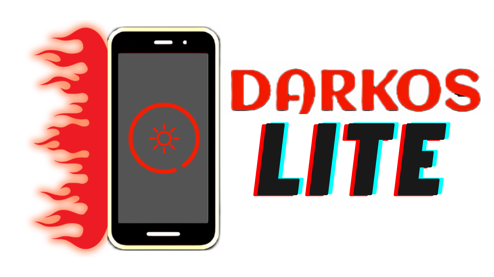

**DarkOS Lite** is a project designed to run Windows x86_64 applications and games in [Termux](https://github.com/termux/termux-app) native GLIBC.
Based on [DarkOS](https://github.com/ahmad1abbadi/darkos), this version is lighter with some updated libraries.
It utilizes [Box86](https://github.com/ptitSeb/box86)
and [Box64](https://github.com/ptitSeb/box86)
to run [Wine](https://www.winehq.org/) on android.

# Installation:
1. Install
[Termux](https://f-droid.org/repo/com.termux_118.apk),
[Termux-X11](https://github.com/ahmad1abbadi/extra/releases/download/apps/termux-x11.apk) and
[Input Bridge v0.1.9.9](https://github.com/ahmad1abbadi/extra/releases/download/apps/InputBridge_v0.1.9.9.apk) or [Input Bridge v0.0.7](https://github.com/ahmad1abbadi/extra/releases/download/apps/input+bridge+0.0.7.apk)
or 
[X input Bridge](https://github.com/ahmad1abbadi/extra/releases/download/apps/XinputBridge.apk)
for using game controller (Bluetooth/ usb) inside wine.

1. Open Termux and paste the following command:
```bash
curl -o install https://raw.githubusercontent.com/ahmad1abbadi/darkos-lite/main/installOS.sh && chmod +x install && ./install
```

3. **DarkOS Lite** will automatically start after installation is complete.
   Remember each time you open Termux, DarkOS will auto-start.
   
   To exit **DarkOS Lite** and use Termux normally, press '1' within the first 4 seconds. Otherwise, DarkOS will start and run Wine + Termux-X11.
   
  
## DarkOS Configuration App:

### Box64/Box86 Configuration + Dynarec
The configuration can be easily done from the DarkOS configuration app. Simply modify the Box options, click "Apply," and then "Reboot" to apply the changes.

For more information about dynarec variables see [Box64 usage](https://github.com/ptitSeb/box64/blob/main/docs/USAGE.md) and [Box86 usage](https://github.com/ptitSeb/box86/blob/master/docs/USAGE.md)

### Update OS
This option updates DarkOS to the latest version.

### Wine Manager 
Wine can be installed or uninstalled from the DarkOS configuration embedded within Wine. Simply select the "Wine manager" option.

To select a Wine container, use the container dropdown menu from the DarkOS configuration and then click "Change container."

### Toggle Mangohud
Mangohud is an on-screen display (OSD) that shows useful information like FPS, CPU usage, GPU load, and GPU temperature.

Currently, to see GPU load and temperature stats, you need to disable SELinux by running the following command in Termux(root is required):
```
su -c setenforce 0
```
To re-enable SELinux:

```
su -c setenforce 1
```

### Switch IB
This toggle lets you switch the input bridge between version 0.1.9.9 and version 0.0.7. Choose the version that works best for you.

### Kill Services
Use this toggle to kill services.exe without needing to open the task manager.

### Hit F5 key
This will open the task manager.

### Install Tweaks
This option lets you install Wine tricks like apps, DLLs, and fonts.

### TDB MANAGER
This option lets you install Box64, Turnip, DXVK and VKD3D updated versions, that could come from an online updated list

## Safe Mode Configuration:

### Start in SAFE MODE
This option lets you choose the container you want to run, with some deactivated functions. Helpfull for solving problems that could made the container unusable

### Settings:

#### <ins>Update OS</ins>
Update whole DarkOS system if there's an available update

#### <ins>Repair DarkOS Files</ins>
Reinstalls DarkOS filesystem, going back to default install

#### <ins>Winetricks</ins>
Allows you to install Wine additional packages (like vcruntime, fonts, etc) using GUI (not working now) or Command Verbs

#### <ins>Delete Prefix</ins>
Removes selected container's prefix, to make a clean reinstallation of the same

#### <ins>Change Auto-Start Setting</ins>
Decide if DarkOS can start automatically when Termux app is opened

#### <ins>Debug Mode</ins>
This option generate a logfile in /sdcard/darkos folder, and tracefiles on /sdcard/darkos/trace, that could be helpfull for developers for troubleshots resolution. You can share them on Telegram/Discord groups (but check if the game is working on other projects before)

#### <ins>Boost CPU</ins>
**Available only for rooted users**. This option enhance the CPU usage and may improve overall performance

#### <ins>Autoclean RAM</ins>
**EXPERIMENTAL**. This option cleans user RAM consumption on every DarkOS launch, killing other launching apps except IB and DarkOS itself. Useful for low RAM devices

#### <ins>Move Games to Termux Internal Filesystem</ins>
By moving the games to Drive G (internal filesystem), some of them (specially DX12 ones) gain a huge performance improvements, like Resident Evil games. Remember to set back your games to the original path before uninstalling DarkOS, otherwise your games will be lost!

#### <ins>Build Box64</ins>
Build the most bleeding edge Box64 version manually from the ptitSeb repository, including the BOX32 supported version, and different Snapdragon CPU support.
**IMPORTANT**: This command will break if Phantom Process Killer is activated. Check **Known Issues** to prevent this

### Exit Safe Mode:
Just boot DarkOS normally

### Kill DarkOS and Exit to Terminal
Self explanatory

## Termux-X11 resolution 
The fallback resolution is only used when the X11 resolution cannot be detected automatically. The default fallback resolution is 800x600.

## Termux and termux-x11 preferences
### recommend setup for termux:
* `Allow apps to open new windows while running in the background`
* `Allow apps to display pop-up windows`

### recommend setup for termux-x11:
* `Display resolution mode` exact
* `Display resolution` 1280x720
* `Reseed Screen While Soft Keyboard is open` OFF
* `Fullscreen on device display` ON
* `Force Landscape orientation` ON
* `Hide display cutout` ON
* `Show additional keyboard` OFF
* `Prefer scancodes when possible` ON
* `Enable Accessibility service for intercepting system shortcuts manually.` enable termux-x11 from android accessibility menu so you can use external keyboard (wired/wireless) without issues.
* `Enable Accessibility service for intercepting system shortcuts automatically.` ON

## Controls
For touch controls Input Bridge app is required.

## Support status
**Android 10 or higher is recommended.

### Device
* Most Android phones equipped with a Mali GPU can run DirectX 9 games using [Mesa VirGL](https://github.com/alexvorxx/Mesa-VirGL) . It is recommended to use a Snapdragon device with Adreno 6xx or Adreno 7xx for optimal performance and compatibility with Turnip and [DXVK](https://github.com/doitsujin/dxvk).

### Root
* Root is not required.

## Known issues
* termux app can show signal 9 when using wine or while compiling box64, in this case you have to disable android phantom process killer by running this command with the device connected to a PC using ADB:
```
adb shell "/system/bin/device_config put activity_manager max_phantom_processes 2147483647"
```
  
## Support DarkOS-Lite
[PAYPAL](https://paypal.me/GabiAle97?country.x=AR&locale.x=es_XC)


## DarkOS Developers 

[AZ](https://github.com/ahmad1abbadi) 

[Hisham](https://github.com/hisham2630)

[Md arif](https://github.com/sabamdarif)

[zhongerxll](https://github.com/zhongerxll) 

[Ilan12346-maya](https://github.com/Ilan12346-maya)
  
[GabiAle97](https://github.com/GabiAle97)

#

thanks to our testers:

GhostDz36, caoji080

#
Huge thanks to:

[airidosas252](https://github.com/airidosas252) for his turnip and wine builds.
#
Special thanks to ptitSeb, Maxython, glibc-runner, hardray, T?aik, zhongerxll , hugo, .[jeezdisreez](https://github.com/Pipetto-crypto), olegos2 and others for help.

[DarkOS Telegram Group](https://t.me/DARKOS4android)
[DarkOS Discord Group](https://discord.gg/GHpzpuSebc)

## Third party applications

[glibc-packages](https://github.com/termux-pacman/glibc-packages)

[Box64](https://github.com/ptitSeb/box64)

[Box86](https://github.com/ptitSeb/box86)

[DXVK](https://github.com/doitsujin/dxvk)

[DXVK-ASYNC](https://github.com/Sporif/dxvk-async)

[DXVK-GPLASYNC](https://gitlab.com/Ph42oN/dxvk-gplasync)

[VKD3D](https://github.com/lutris/vkd3d)

[D8VK](https://github.com/AlpyneDreams/d8vk)

[Termux-app](https://github.com/termux/termux-app)

[Termux-x11](https://github.com/termux/termux-x11)

[Wine](https://wiki.winehq.org/Licensing)

[wine-ge-custom](https://github.com/GloriousEggroll/wine-ge-custom)

[Mesa](https://docs.mesa3d.org/license.html)

[Mangohud](https://github.com/flightlessmango/MangoHud)